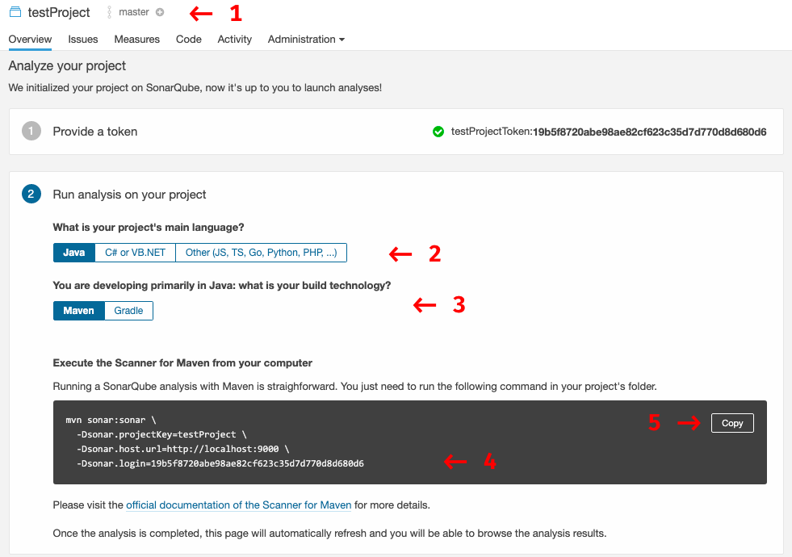

# docker-sonar

## Building the image

```bash
docker build -t parana/sonarqube .
```

> Because SonarQube uses an embedded Elasticsearch, make sure that your Docker host configuration complies with the Elasticsearch production mode requirements and File Descriptors configuration.  For example, on Linux, you can set the recommended values for the current session by running the following commands as root on the host:

```bash
sysctl -w vm.max_map_count=262144
sysctl -w fs.file-max=65536
ulimit -n 65536
ulimit -u 4096
```

We recommend creating volumes for the following directories:

- /opt/sonarqube/conf: for Version 7.9.x only, configuration files, such as sonar.properties.
- /opt/sonarqube/data: data files, such as the embedded H2 database and Elasticsearch indexes
- /opt/sonarqube/logs: contains SonarQube logs about access, web process, CE process, Elasticsearch logs
- /opt/sonarqube/extensions: plugins, such as language analyzers

Warning: You cannot use the same volumes on multiple instances of SonarQube.

## Configuring Postgres Database

```bash
mkdir -p postgres-data
docker run -d -h sonar-postgres \
    --name sonar-postgres \
    -e POSTGRES_PASSWORD=mysecretpassword \
    -e PGDATA=/var/lib/postgresql/data/pgdata \
    -v $PWD/postgres-data:/var/lib/postgresql/data \
    postgres:12.4

docker exec -it sonar-postgres bash
sudo -u postgres psql

CREATE DATABASE sonarqube WITH ENCODING 'UTF8';
CREATE USER sonarqube WITH ENCRYPTED PASSWORD 'sonarsecretpassword';
GRANT ALL PRIVILEGES ON DATABASE sonarqube TO sonarqube;
ALTER DATABASE sonarqube OWNER TO sonarqube;
\q
```

## Executing the container

Avoid hard termination of SonarQube
Starting from SonarQube 7.8, SonarQube stops gracefully, waiting for any tasks in progress to finish. Waiting for in-progress tasks to finish can take a large amount of time which the docker does not expect by default when stopping. To avoid having the SonarQube instance killed by the Docker daemon after 10 seconds, it is best to configure a timeout to stop the container with --stop-timeout. For example:

docker run  sonarqube

```bash
mkdir -p conf data logs extensions/plugins
touch conf/sonar.properties
echo "sonar.jdbc.username=sonarqube" > conf/sonar.properties
echo "sonar.jdbc.password=mypassword" >> conf/sonar.properties
echo "sonar.jdbc.url=jdbc:postgresql://sonar-postgres/sonarqube" >> conf/sonar.properties

docker run -d --stop-timeout 3600 -h sonarqube \
       -v $PWD/conf:/opt/sonarqube/conf \
       -v $PWD/data:/opt/sonarqube/data \
       -v $PWD/logs:/opt/sonarqube/logs \
       -v $PWD/extensions:/opt/sonarqube/extensions \
       --name sonarqube -e SONAR_ES_BOOTSTRAP_CHECKS_DISABLE=true \
       -p 9000:9000 \
       parana/sonarqube

docker logs sonarqube -f
```

```bash
docker exec -it sonarqube bash
```

Inside the Container you can monitor sonar log files for issues.

```bash
# SonarQube service log
tail -f /opt/sonarqube/logs/sonar.log

# Web Server logs
tail -f /opt/sonarqube/logs/web.log

# ElasticSearch logs
tail -f /opt/sonarqube/logs/es.log

# Compute Engine logs
tail -f /opt/sonarqube/logs/ce.log
```

Inside the container you also can run some awesome commands.

```bash
ps -ef
uname -a
cat /etc/hosts
cat /etc/os-release
ifconfig
netstat -tulpn
htop
```

## Analyzing a Project

Log in to http://localhost:9000 with Administrator credentials (login=**admin**, password=**admin**).

Now that you're logged in to your local SonarQube instance, let's analyze a project:

- Click the Create new project button.
- Give your project a Project key and a Display name and click the Set Up button.
- Under Provide a token, select Generate a token. Give your token a name, click the Generate button, and click Continue.
- Select your project's main language under Run analysis on your project, and follow the instructions to analyze your project. Here you'll download and execute a Scanner on your code (if you're using Maven or Gradle, the Scanner is automatically downloaded).



After successfully analyzing your code, you'll see your first analysis on SonarQube

## Other properties with make sense

```bash
# DATABASE
sonar.jdbc.username=sonarqube
sonar.jdbc.password=<sonar-user-password>
sonar.jdbc.url=jdbc:postgresql://sonar-postgres/sonarqube
sonar.jdbc.maxActive=60
sonar.jdbc.maxIdle=5
sonar.jdbc.minIdle=2
sonar.jdbc.maxWait=5000
sonar.jdbc.minEvictableIdleTimeMillis=600000
sonar.jdbc.timeBetweenEvictionRunsMillis=30000
sonar.jdbc.removeAbandoned=true
sonar.jdbc.removeAbandonedTimeout=60

# WEB SERVER
sonar.web.host=0.0.0.0
sonar.web.port=9000
sonar.web.javaOpts=-server -Xms512m -Xmx512m -XX:+HeapDumpOnOutOfMemoryError
sonar.search.javaOpts=-server -Xms512m -Xmx512m -XX:+HeapDumpOnOutOfMemoryError
sonar.ce.javaOpts=-server -Xms512m -Xmx512m -XX:+HeapDumpOnOutOfMemoryError

# ACTIVE DIRECTORY CONFIGURATIONS
sonar.security.realm=LDAP
sonar.security.savePassword=true
sonar.authenticator.downcase = true
ldap.url=ldap://<ldap-server>.zone24x7.lk:389
ldap.bindDn=<ldap-user>@zone24x7.lk
ldap.bindPassword=<ldap-password>
ldap.user.baseDn=dc=zone24x7,dc=lk
ldap.user.request=(&(objectClass=User)(sAMAccountName={login}))
ldap.user.realNameAttribute=cn
ldap.user.emailAttribute=mail
```
